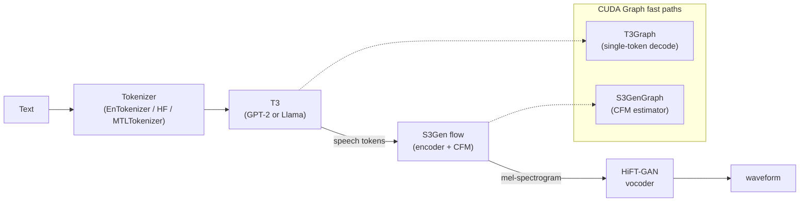
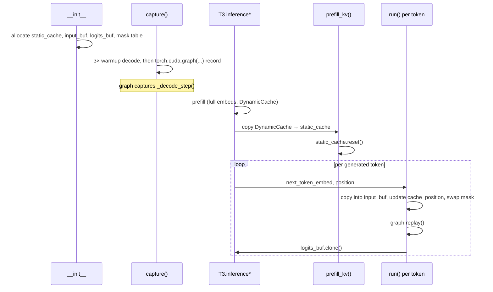
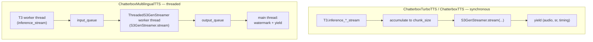

# ARCHITECTURE.md — Chatterbox TTS Fork

This document describes **how the inference pipeline is shaped** and
**why it is shaped that way**. It complements [`AGENTS.md`](AGENTS.md),
which captures the working policy (version pins, verification, checklist).
The two files do not duplicate each other; this one focuses on structure,
rationale, known bugs, and non-obvious decisions.

> **Source-of-truth rule.** If anything here disagrees with the code,
> the code wins and this document is the bug. Performance numbers are
> deliberately not pinned in this file — see §7.

---

## 1. Overview

The fork keeps the original Chatterbox three-stage pipeline and adds two
CUDA Graph subsystems plus a streaming layer:



There are three high-level entry points, none of them symmetric:

| Class | Module | T3 backbone | CUDA Graphs | Streaming | Status |
|---|---|---|---|---|---|
| `ChatterboxTTS` (EN) | [`src/chatterbox/tts.py`](src/chatterbox/tts.py) | GPT-2 medium + learned speech pos-emb | not wired | sync | upstream only, not maintained |
| `ChatterboxTurboTTS` (EN) | [`src/chatterbox/tts_turbo.py`](src/chatterbox/tts_turbo.py) | GPT-2 medium (Turbo) | T3Graph(B=1) | sync | upstream only, not maintained |
| `ChatterboxMultilingualTTS` | [`src/chatterbox/mtl_tts.py`](src/chatterbox/mtl_tts.py) | Llama_520M | T3Graph(B=2) + S3GenGraph | threaded | **active target** |

`ChatterboxTurboTTS` is intentionally not re-exported from
[`src/chatterbox/__init__.py`](src/chatterbox/__init__.py).

The text→speech-token model is **T3**; the speech-token→waveform model is
**S3Gen** (CFM decoder + HiFT-GAN vocoder). Backbone configs are defined
in [`src/chatterbox/models/t3/llama_configs.py`](src/chatterbox/models/t3/llama_configs.py)
(`Llama_520M`, `GPT2_medium`). The HuggingFace generate-compatible wrapper
lives in [`src/chatterbox/models/t3/inference/t3_hf_backend.py`](src/chatterbox/models/t3/inference/t3_hf_backend.py).

---

## 2. Model Zoo: what differs between the three classes

> **Scope note.** Only `ChatterboxMultilingualTTS` is the active
> development target of this fork. The subsections on `ChatterboxTTS`
> and `ChatterboxTurboTTS` are preserved for reference; do not modify
> those classes or their tests in this fork.

The three TTS classes are similar at a glance but have small, important
differences. Treat them as siblings, not as a single hierarchy.

### Conditioning is shared

All three use the same `Conditionals` dataclass:

- `T3Cond` for T3: `speaker_emb` (from voice encoder), optional
  `cond_prompt_speech_tokens`, optional `emotion_adv`.
- `dict` for S3Gen: `prompt_token`, `prompt_token_len`, `prompt_feat`,
  `prompt_feat_len`, `embedding` (x-vector).

`prepare_conditionals(wav_fpath)` resamples to 16 kHz, runs the voice
encoder, computes mel features at 24 kHz, and tokenizes the reference
audio. The result is cached on the instance and reused for every
subsequent `generate*` call until replaced.

### What differs

- **Tokenizer**:
  - `ChatterboxTTS` → `EnTokenizer` (BPE from `tokenizer.json`).
  - `ChatterboxTurboTTS` → HF `AutoTokenizer` (vocab 50276).
  - `ChatterboxMultilingualTTS` → `MTLTokenizer` with `language_id`
    parameter (23 languages).

- **T3 backbone**:
  - `ChatterboxTTS` and `ChatterboxTurboTTS` use **GPT-2 medium** with the
    `LearnedPositionEmbeddings` add-on (`speech_pos_emb.get_fixed_embedding(i)`
    is added to the speech embeddings).
  - `ChatterboxMultilingualTTS` uses **Llama_520M** with RoPE (no
    additive speech position embedding).

  Code branches on `self.is_gpt` in `T3` (see [`src/chatterbox/models/t3/t3.py`](src/chatterbox/models/t3/t3.py)).

- **CFG**:
  - Turbo runs with `cfg_weight=0.0` by default (no CFG).
  - Multilingual uses `cfg_weight=0.5` and duplicates the text token
    batch (`B=2`) so the conditional and unconditional forward share a
    single graph replay.

- **S3Gen meanflow & CFM timestep budget**:
  - Turbo loads S3Gen with `meanflow=True` (distilled model).
  - **Fork default for all paths: 2 CFM Euler steps** (set in
    `S3Token2Wav.flow_inference`, see
    [`src/chatterbox/models/s3gen/s3gen.py`](src/chatterbox/models/s3gen/s3gen.py)).
    Upstream defaulted to 10 for the regular CFM model. Empirical
    verification on MTL-RU (Whisper-medium WER, SQUIM-STOI, perceptual
    A/B on short/medium/long phrases) showed 2 vs 10 produce different
    ODE trajectories (mel-spectrogram L1 ≈ 0.9 in log10 domain) but no
    audible degradation. 2 steps reduce S3GenGraph replays per chunk
    by 5x, which is what lets MTL streaming hit RTF < 1.0. Override
    via `n_cfm_timesteps=` only if you suspect ODE-induced artifacts on
    a specific voice or text.

- **Tail trim in `generate()`**:
  - Multilingual drops the last speech token's audio
    (`st_len = max(1, n_tokens - 1)`) because attention degrades just
    before EOS and decodes ~40 ms of noise.
  - Turbo appends three `S3GEN_SIL` silence tokens before decoding.
  - `ChatterboxTTS` does neither — its `generate()` returns the raw
    decoded waveform with watermark applied.

- **`use_cuda_graph`**:
  - Wired in `tts_turbo.py` (creates `T3Graph(batch_size=1)`).
  - Wired in `mtl_tts.py` (creates `T3Graph(batch_size=2)` and
    `S3GenGraph` for the CFM estimator).
  - **Not wired** in `tts.py`. Adding it would require deciding what
    `batch_size` to capture (it depends on whether `cfg_weight > 0`).

- **`skip_watermark`**:
  - Available on `ChatterboxTurboTTS` and `ChatterboxMultilingualTTS`.
  - Not available on `ChatterboxTTS` — watermark is always applied.

- **Multilingual-only runtime defaults** (`mtl_tts.py`):
  - **TF32 + matmul precision**: `ChatterboxMultilingualTTS.__init__` enables
    `torch.backends.cuda.matmul.allow_tf32`, `cudnn.allow_tf32`, and
    `torch.set_float32_matmul_precision("high")` when the target device is CUDA.
    This accelerates fp32 paths (notably the CFM `ConditionalDecoder` while
    `estimator_dtype` stays fp32). The knobs are **process-global**;
    constructing MTL in an interpreter can change numerics for unrelated PyTorch
    code in the same process.
  - **HiFT + F0 `weight_norm` collapse**: `from_local()` calls
    `s3gen.mel2wav.remove_weight_norm()` and
    `s3gen.mel2wav.f0_predictor.remove_weight_norm()` immediately after
    `load_state_dict` and `.to(device).eval()`. The vocoder wraps most conv
    layers in `torch.nn.utils.parametrizations.weight_norm`, which would
    otherwise recompute the effective weight on every forward. The implementation
    uses `torch.nn.utils.parametrize.remove_parametrizations(..., leave_parametrized=True)`
    (not the legacy `torch.nn.utils.remove_weight_norm`, which does not match
    the parametrizations API). **`from_pretrained` → `from_local` is the only
    production load path that applies this**; ad-hoc construction of `S3Gen`
    without going through `from_local` keeps the parametrizations.

---

## 3. T3 Inference: StaticCache + CUDA Graphs

### Why this exists

A naïve `transformers.generate` allocates KV-cache tensors per step
(`DynamicCache`) and rebuilds attention masks on the CPU. Both are
incompatible with `torch.cuda.CUDAGraph.replay()`, which requires every
input tensor to live at a stable address.

The fix is two-layered:

1. Replace `DynamicCache` with `transformers.StaticCache` after the
   prefill step.
2. Wrap a single autoregressive decode step in a captured CUDA graph and
   replay it for every subsequent token.

### `T3Graph` lifecycle

Code: [`src/chatterbox/models/t3/t3_graph.py`](src/chatterbox/models/t3/t3_graph.py).



Key invariants encoded in `T3Graph`:

- **Static buffers** are allocated once at `__init__`:
  - `input_buf` `[B, 1, hidden_size]`,
  - `logits_buf` `[B, 1, speech_tokens_dict_size]`,
  - `cache_position` `[1]`, `position_ids` `[B, 1]`,
  - `active_mask` is a single `[B, 1, 1, max_seq_len]` tensor that is
    overwritten by `copy_(self.attn_mask_table[position])` on every step.
- **Pre-computed attention mask table** with one ready-to-copy causal mask
  per position up to `max_seq_len=2048`. This avoids any mask construction
  on the hot path.
- **Dual prefill path** in `prefill_kv()`:
  - GPT-2 backbones return `past_key_values` as a `tuple(tuple(k, v), ...)`.
  - Llama backbones return a `DynamicCache` with `.layers[i].keys/.values`.
  - Both shapes are copied into the same `StaticCache` slots. The
    branch is `isinstance(past_key_values, tuple)`.
- **`batch_size`**:
  - Turbo creates `T3Graph(batch_size=1)`.
  - Multilingual creates `T3Graph(batch_size=2)` because CFG processes
    the conditional and unconditional branches in the same batch.
- **`max_seq_len=2048`** is the hard upper bound for a single generation.
  Raising it grows `StaticCache` and the mask table linearly.

### Hot loop invariants

These rules are what makes `graph.replay()` safe. Violating any of them
voids the optimization and tends to surface as "illegal memory access"
or as silent fall-back to baseline speed:

- No `.item()`, `.tolist()`, `print`, or other CPU sync on tensors that
  flow through the graph.
- No Python-side `if` on tensor values inside the per-token loop.
- The token sampler (top-p / min-p / repetition penalty) runs **outside**
  the graph, on CPU/host logic, after copying the static `logits_buf`.
- `StaticCache.reset()` must be called before every new prefill (handled
  by `prefill_kv()`).

### Integration with the T3 API

In [`src/chatterbox/models/t3/t3.py`](src/chatterbox/models/t3/t3.py),
four entry points all share the same fast path when
`self.t3_graph is not None and self.t3_graph.captured`:

- `inference()` — used by `ChatterboxTTS.generate()` and
  `ChatterboxMultilingualTTS.generate()`.
- `inference_turbo()` — `ChatterboxTurboTTS.generate()`.
- `inference_stream()` — generator counterpart of `inference()`, used by
  `ChatterboxTTS.generate_streaming` and the MTL streaming worker.
- `inference_turbo_stream()` — generator counterpart for Turbo streaming.

Each performs a normal prefill (which builds a `DynamicCache`), then
hands that cache to `T3Graph.prefill_kv()` and switches the decode loop
to `T3Graph.run(next_token_embed, position=...)`.

---

## 4. S3Gen Decoder

S3Gen turns speech tokens into a waveform in two stages: a flow-matching
**CFM decoder** produces a mel-spectrogram, then **HiFT-GAN** vocodes it.

- `S3Token2Mel` and `S3Token2Wav` in
  [`src/chatterbox/models/s3gen/s3gen.py`](src/chatterbox/models/s3gen/s3gen.py).
- CFM internals: [`src/chatterbox/models/s3gen/flow.py`](src/chatterbox/models/s3gen/flow.py),
  [`src/chatterbox/models/s3gen/flow_matching.py`](src/chatterbox/models/s3gen/flow_matching.py),
  [`src/chatterbox/models/s3gen/decoder.py`](src/chatterbox/models/s3gen/decoder.py).
- Vocoder: [`src/chatterbox/models/s3gen/hifigan.py`](src/chatterbox/models/s3gen/hifigan.py).

### `S3GenGraph` — CUDA Graph for the CFM estimator

Code: [`src/chatterbox/models/s3gen/s3gen_graph.py`](src/chatterbox/models/s3gen/s3gen_graph.py).

The CFM decoder runs a small ODE (fork default: 2 Euler steps for both
the regular CFM model and Turbo's meanflow — see §"S3Gen meanflow & CFM
timestep budget"). The most expensive component inside that loop is the
estimator — a UNet-style `ConditionalDecoder`. Each ODE step calls the
estimator with constant inputs (`mu`, `mask`, `spks`, `cond`) and
time-varying inputs (`x`, `t`, `r`). That is a perfect graph target.

`S3GenGraph` captures one estimator call with:

- `B=2` static buffers (always sized for CFG, even when CFG is off the
  graph is still safe).
- `max_frames=240` cap; for longer outputs the wrapper falls back to a
  non-graph call.
- Split API:
  - `prepare(mu, mask, spks, cond)` copies the constants into the static
    buffers once per generation.
  - `step(x, t, r)` copies only the time-varying inputs and calls
    `replay()`. This is what runs inside the ODE loop.
- The output buffer `static_dxdt` is populated by replay and sliced
  back to the actual `T` length the caller asked for.

Integration is a single-line injection in
[`src/chatterbox/mtl_tts.py`](src/chatterbox/mtl_tts.py):

```python
estimator = self.s3gen.flow.decoder.estimator
self.s3gen_graph = S3GenGraph(estimator, max_frames=240, device=device)
self.s3gen_graph.capture()
estimator.s3gen_graph = self.s3gen_graph
```

The estimator's own `forward` method picks up `self.s3gen_graph` and
routes through it when applicable. There is no separate code path in
`S3Gen.flow_inference()` for the graph case.

---

## 5. Streaming Pipeline

### Contract

All three classes expose `generate_streaming(...)`, a generator yielding:

```python
(audio_chunk_np, sample_rate, timing_dict)
```

`timing_dict` contains at least `chunk_index`, `chunk_steps`,
`prefill_ms`, `decode_ms`, and `is_final` (bool). The `is_final` flag is
attached to **exactly the last** yielded chunk, never to any other,
because consumers use it to flush jitter buffers and close playback
streams.

### `S3GenStreamer`

Code: [`src/chatterbox/models/s3gen/s3gen_streamer.py`](src/chatterbox/models/s3gen/s3gen_streamer.py).

Stateful wrapper around `S3Gen.flow_inference()` and
`S3Gen.hift_inference()`. Carries the following state across chunks:

1. **Pre-encoded prompt** (`prompt_enc`, `prompt_mask`). The reference
   voice tokens are run through `flow.input_embedding` and
   `flow.encoder` exactly once at the start of the stream. Every
   subsequent chunk passes them in pre-computed via
   `S3Gen.flow_inference(..., prompt_enc=..., prompt_mask=...)`.
2. **Sliding window** over accumulated speech tokens
   (`window_size=120`, plus `pre_lookahead=3` from the flow model). Once
   the buffer exceeds the window, the oldest tokens are dropped. This
   keeps CFM cost from growing with utterance length. The corresponding
   prefix of the vocoder state (`last_s`) is dropped in lock-step so the
   waveform stays aligned.
3. **Vocoder source state** (`last_s`). HiFT-GAN's source-signal output
   from the previous chunk is fed back via `hift_inference(..., cache_source=self.last_s)`,
   so chunk boundaries do not introduce phase discontinuities or clicks.

4. **Host copy**: After `hift_inference`, only the audio **tail** not yet
   yielded—`output_wavs[0, prev_audio_len:]`—is copied to NumPy. The full
   sliding-window waveform (tens of ms × sample rate) stays on GPU until
   discarded; this is an I/O optimization only and does not change sample
   values relative to copying the full tensor then slicing on CPU.

Lookahead trimming (`pre_lookahead=3`) is required by the causal CFM:
the last three tokens of every non-final chunk are held back and only
released once more tokens arrive (or `finalize=True`).

### Two execution models



- **Synchronous** (`ChatterboxTTS`, `ChatterboxTurboTTS`): one Python
  generator loop. Tokens are produced by `T3.inference_*_stream()` and
  decoded by `S3GenStreamer.stream()` on the calling thread.
- **Threaded** (`ChatterboxMultilingualTTS`): wraps `S3GenStreamer` in
  `ThreadedS3GenStreamer`
  ([`src/chatterbox/utils/streaming_utils.py`](src/chatterbox/utils/streaming_utils.py)).
  A T3 worker thread runs `inference_stream` and pushes token chunks to
  an input queue; a vocoder worker thread consumes them and pushes audio
  chunks to an output queue; the main thread drains the output queue,
  applies watermark, and yields. This overlaps T3 prefill+decode with
  S3Gen synthesis.

Both paths share four behaviours:

- **OOV filtering**: `token < 6561` drops invalid IDs before chunking.
- **SOS/EOS filtering** (MTL only): special tokens that occur mid-stream
  are skipped before being pushed to the vocoder.
- **`pending` lookahead pattern**: each loop holds the previous chunk
  back by one iteration so `is_final=True` is attached only when the
  next chunk is known to not exist.
- **Trim/fade on chunk 0**: the first chunk is multiplied by
  `s3gen.trim_fade` to match `generate()`.

### MTL-specific finalization

`ChatterboxMultilingualTTS.generate_streaming` drops the last
`samples_per_token` samples (≈40 ms at 24 kHz) of the very last chunk,
mirroring the `wav = wav[: st_len * samples_per_token]` trim that
`generate()` applies for the same reason (EOS-adjacent attention noise).

---

## 6. Non-Obvious Design Decisions and Known Quirks

These are the things that look strange to a fresh reader and are
deliberate. Do not "fix" them.

### CFM ODE starts from zero, not random noise

In [`src/chatterbox/models/s3gen/flow_matching.py:212`](src/chatterbox/models/s3gen/flow_matching.py):

```python
z = torch.zeros_like(mu)
```

The upstream code uses `randn`. The fork uses zeros because:

- It is deterministic, so two runs of the captured CUDA graph produce
  the same output for the same input (CUDA graphs do not capture
  RNG state in a portable way).
- Bit-parity with upstream is impossible by definition, and
  `verify_regression.py` is written around that fact. The
  `upstream_quality` phase uses SQUIM-STOI and relative WER, not MSE.

### Last speech token's audio is discarded (MTL only)

In `ChatterboxMultilingualTTS.generate()`:

```python
st_len = max(1, n_tokens - 1)
wav = wav[: st_len * (S3GEN_SR // S3_TOKEN_RATE)]
```

Attention degrades right before EOS and the final token decodes to ~40 ms
of noise. The streaming path mirrors this by trimming
`samples_per_token` from the final chunk.

### `S3Token2Mel.forward(self, ...)` — explicit, not `self.forward`

In [`src/chatterbox/models/s3gen/s3gen.py:326`](src/chatterbox/models/s3gen/s3gen.py):

```python
output_mels = S3Token2Mel.forward(
    self, speech_tokens, ...
)
```

`S3Token2Wav` inherits from `S3Token2Mel`. Calling `self.forward(...)`
would dispatch to `S3Token2Wav.forward`, which returns waveforms, not
mels, and crashes the F0 predictor downstream. The unbound-method call
forces the parent's behaviour explicitly.

### Streaming MSE is structurally non-zero

`S3GenStreamer` uses prompt caching and a stateful vocoder, neither of
which the one-shot `generate()` path exercises. The streamed waveform
therefore cannot match `generate()` bit-for-bit; the difference is
reported by `verify_regression.py` as **informational** MSE.
SQUIM-STOI and a length-bound check are the actual quality gates;
the thresholds themselves live in [`AGENTS.md`](AGENTS.md).

### `ChatterboxTurboTTS` is not exported from `__init__.py`

Only `ChatterboxTTS`, `ChatterboxVC`, and `ChatterboxMultilingualTTS`
are re-exported from
[`src/chatterbox/__init__.py`](src/chatterbox/__init__.py). Turbo is
imported as `from chatterbox.tts_turbo import ChatterboxTurboTTS`. Do
not assume `from chatterbox import ChatterboxTurboTTS` works.

### `ChatterboxTTS` has no CUDA Graph wiring

The English non-Turbo class accepts a `cfg_weight` that toggles the
batch dimension (1 with CFG off, 2 with CFG on). A single `T3Graph`
cannot serve both shapes, so the wiring would need either two captured
graphs or a fixed CFG mode. The current code simply has no
`use_cuda_graph` parameter on this class. Treat it as a known
limitation, not a bug.

### Watermarking can be skipped

`PerthImplicitWatermarker.apply_watermark` adds a few milliseconds per
chunk. Turbo and Multilingual expose `skip_watermark: bool = False` on
both `generate` and `generate_streaming`. `ChatterboxTTS` does not.

### CFM attention is non-causal

The CFM decoder uses full-context attention. That means the
representation of a given token shifts slightly when more tokens are
appended on the right. Streaming reduces this effect with the sliding
window but cannot eliminate it — another reason streaming-vs-full MSE
will never approach zero.

---

## 7. Measurement and Verification Surface

This document deliberately does **not** quote benchmark numbers. They
drift with hardware, kernels, and CUDA versions. The repository ships a
proper benchmark surface; consult it instead of hand-typed tables.

| Question | Tool | Output |
|---|---|---|
| Did CUDA Graphs actually speed things up? | [`benchmark_cuda.py`](benchmark_cuda.py) → `benchmarks/cuda.py` | full-gen time, TTFC, peak VRAM for `ChatterboxMultilingualTTS`; optional vs-upstream speedup |
| Does streaming stay real-time? | [`benchmark_rtf.py`](benchmark_rtf.py) → `benchmarks/rtf.py` | RTF, TTFC p50/p95, per-chunk decode |
| Did an optimization break the audio? | [`verify_regression.py`](verify_regression.py) | 3-phase regression (`mtl_ru` / `upstream_quality` / `streaming`) |

Pass/fail thresholds for those tools (MSE, SQUIM-STOI, WER, length
bound) live only in [`AGENTS.md`](AGENTS.md) to avoid drift between
documents. This file deliberately does not restate them.

Every `benchmark_*.py` run persists a JSON in `benchmarks/results/`
tagged with git commit, git branch, and GPU model. Historical
comparisons go through
`benchmarks._results.load_history("cuda" | "rtf")`.

### Why baseline workers live in their own files

`benchmarks/_baseline_waveform_worker.py` and
`benchmarks/_baseline_timing_worker.py` are spawned as subprocesses
running under the **upstream** venv (`CHATTERBOX_REGRESSION_BASELINE_PYTHON`),
where the fork's `benchmarks` package does not exist. They therefore
deliberately re-implement small utilities such as `set_seed` instead of
importing from `benchmarks._utils`. The duplication is intentional —
do not "fix" it.

### Rule for future doc edits

**Do not paste benchmark numbers into this file.** Cite the tool that
produces them. If a number is needed in a discussion, link to a JSON in
`benchmarks/results/` or to the script that generates it.

---

## 8. File Map

Inference entry points:

- [`src/chatterbox/tts.py`](src/chatterbox/tts.py) — `ChatterboxTTS` (EN, no CUDA Graphs)
- [`src/chatterbox/tts_turbo.py`](src/chatterbox/tts_turbo.py) — `ChatterboxTurboTTS` (EN, distilled S3Gen, T3Graph B=1)
- [`src/chatterbox/mtl_tts.py`](src/chatterbox/mtl_tts.py) — `ChatterboxMultilingualTTS` (23 langs, T3Graph B=2, S3GenGraph, threaded streaming)
- [`src/chatterbox/vc.py`](src/chatterbox/vc.py) — voice conversion class
- [`src/chatterbox/__init__.py`](src/chatterbox/__init__.py) — public re-exports

T3 model and optimizations:

- [`src/chatterbox/models/t3/t3.py`](src/chatterbox/models/t3/t3.py) — `T3`, `inference`, `inference_turbo`, `inference_stream`, `inference_turbo_stream`
- [`src/chatterbox/models/t3/t3_graph.py`](src/chatterbox/models/t3/t3_graph.py) — `T3Graph`: StaticCache + captured decode step
- [`src/chatterbox/models/t3/llama_configs.py`](src/chatterbox/models/t3/llama_configs.py) — `Llama_520M`, `GPT2_medium`
- [`src/chatterbox/models/t3/inference/t3_hf_backend.py`](src/chatterbox/models/t3/inference/t3_hf_backend.py) — HF generate-compatible wrapper

S3Gen decoder and streaming:

- [`src/chatterbox/models/s3gen/s3gen.py`](src/chatterbox/models/s3gen/s3gen.py) — `S3Token2Mel`, `S3Token2Wav`, `flow_inference`, `hift_inference`
- [`src/chatterbox/models/s3gen/s3gen_graph.py`](src/chatterbox/models/s3gen/s3gen_graph.py) — `S3GenGraph` for the CFM estimator
- [`src/chatterbox/models/s3gen/s3gen_streamer.py`](src/chatterbox/models/s3gen/s3gen_streamer.py) — stateful streamer (prompt cache, sliding window, `last_s`)
- [`src/chatterbox/models/s3gen/flow.py`](src/chatterbox/models/s3gen/flow.py) — `CausalMaskedDiffWithXvec`
- [`src/chatterbox/models/s3gen/flow_matching.py`](src/chatterbox/models/s3gen/flow_matching.py) — CFM solver; ODE start at zero
- [`src/chatterbox/models/s3gen/decoder.py`](src/chatterbox/models/s3gen/decoder.py) — `ConditionalDecoder` (UNet estimator)
- [`src/chatterbox/models/s3gen/hifigan.py`](src/chatterbox/models/s3gen/hifigan.py) — `HiFTGenerator` vocoder, stateful via `cache_source`

Tokenizers and auxiliary models:

- [`src/chatterbox/models/s3tokenizer/`](src/chatterbox/models/s3tokenizer/) — speech tokenizer (16 kHz, 25 Hz token rate)
- [`src/chatterbox/models/tokenizers/`](src/chatterbox/models/tokenizers/) — text tokenizers (`EnTokenizer`, `MTLTokenizer`)
- [`src/chatterbox/models/voice_encoder/`](src/chatterbox/models/voice_encoder/) — speaker embedding model

Streaming glue:

- [`src/chatterbox/utils/streaming_utils.py`](src/chatterbox/utils/streaming_utils.py) — `ThreadedS3GenStreamer` (used by MTL only)

Verification and benchmarking:

- [`verify_regression.py`](verify_regression.py) — 3-phase regression
- [`benchmark_cuda.py`](benchmark_cuda.py) / [`benchmarks/cuda.py`](benchmarks/cuda.py) — CUDA Graphs benchmark
- [`benchmark_rtf.py`](benchmark_rtf.py) / [`benchmarks/rtf.py`](benchmarks/rtf.py) — streaming RTF benchmark
- [`benchmarks/_baseline_waveform_worker.py`](benchmarks/_baseline_waveform_worker.py), [`benchmarks/_baseline_timing_worker.py`](benchmarks/_baseline_timing_worker.py) — upstream-venv subprocess workers
- [`benchmarks/_model_loader.py`](benchmarks/_model_loader.py), [`benchmarks/_results.py`](benchmarks/_results.py), [`benchmarks/_utils.py`](benchmarks/_utils.py) — shared helpers
- [`benchmarks/README.md`](benchmarks/README.md) — benchmark infrastructure docs
- [`setup_baseline.sh`](setup_baseline.sh) — bootstraps the upstream baseline venv
- [`download_models.py`](download_models.py) — offline weights loader
